# IAM Basics Lab - Solution

**Student Name:** Hafiz Abdul Quddus
**Date Completed:** 08-07-2026

---

## Exercise 1: IAM Groups

### Screenshots:

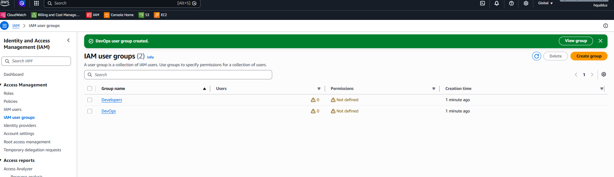

### Groups Created:

- [X] Developers group
- [X] DevOps group

---

## Exercise 2: Group Permissions

### Developers Group:

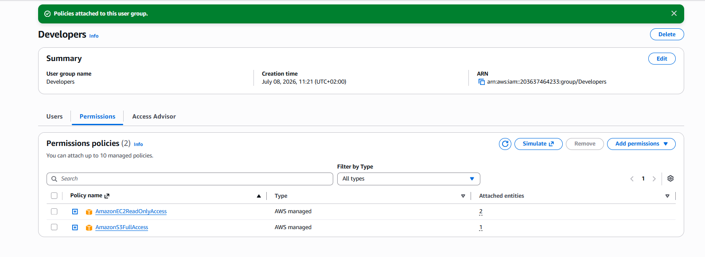

**Policies Attached:**

- AmazonS3FullAccess
- AmazonEC2ReadOnlyAccess

### DevOps Group:

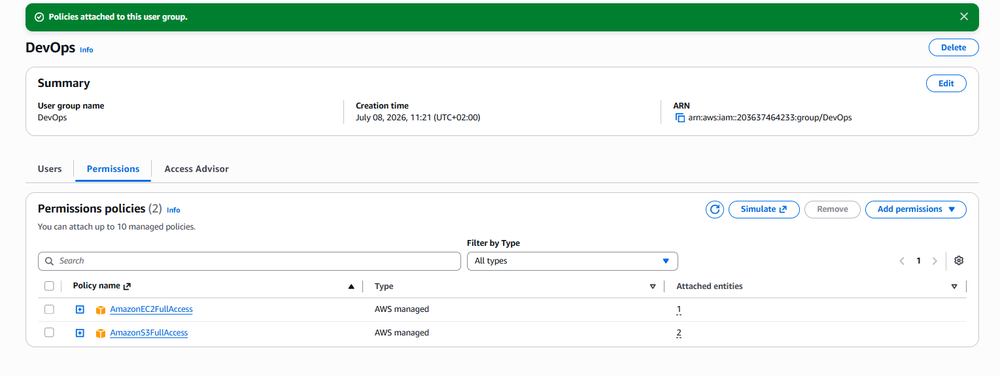

**Policies Attached:**

- AmazonS3FullAccess
- AmazonEC2FullAccess

---

## Exercise 3: IAM Users

### Screenshots:

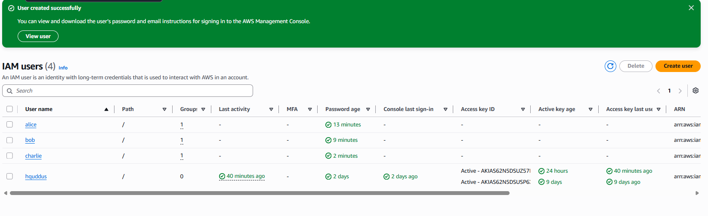

### Users Created:

| Username | Group      | Console Access | Status     |
| -------- | ---------- | -------------- | ---------- |
| alice    | Developers | Yes            | ✅ Created |
| bob      | Developers | Yes            | ✅ Created |
| charlie  | DevOps     | Yes            | ✅ Created |

---

## Exercise 4: Permission Testing

### Alice's Access Tests:

**S3 Access:**
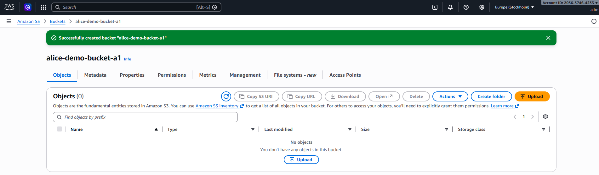

- Create bucket: ✅ SUCCESS
- Upload file: ✅ SUCCESS

**EC2 Access:**
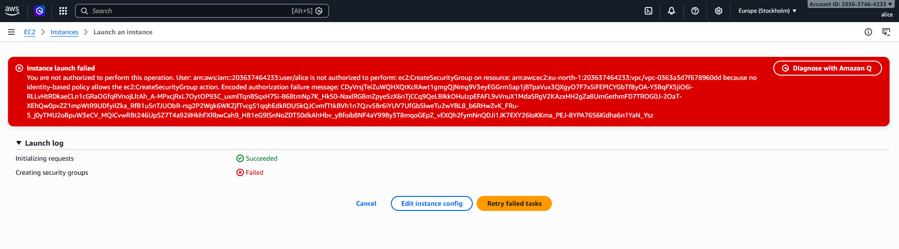

- View instances: ✅ SUCCESS
- Launch instance: ❌ DENIED (Expected)

### Bob's Access Tests:

**S3 Access:**
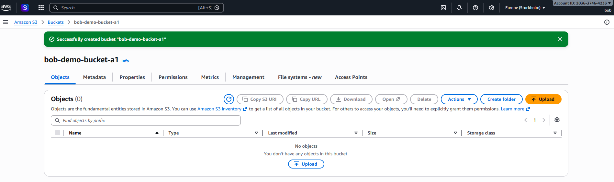

- Create bucket: ✅ SUCCESS

**EC2 Access:**
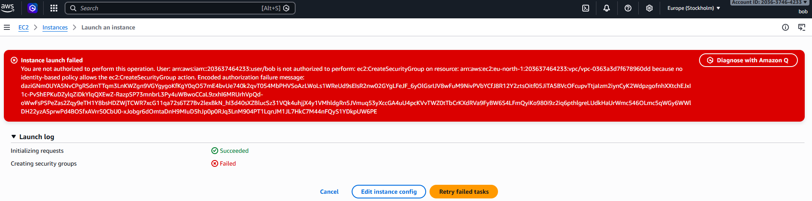

- View instances: ✅ SUCCESS
- Launch instance: ❌ DENIED (Expected)

### Charlie's Access Tests:

**Full Access:**
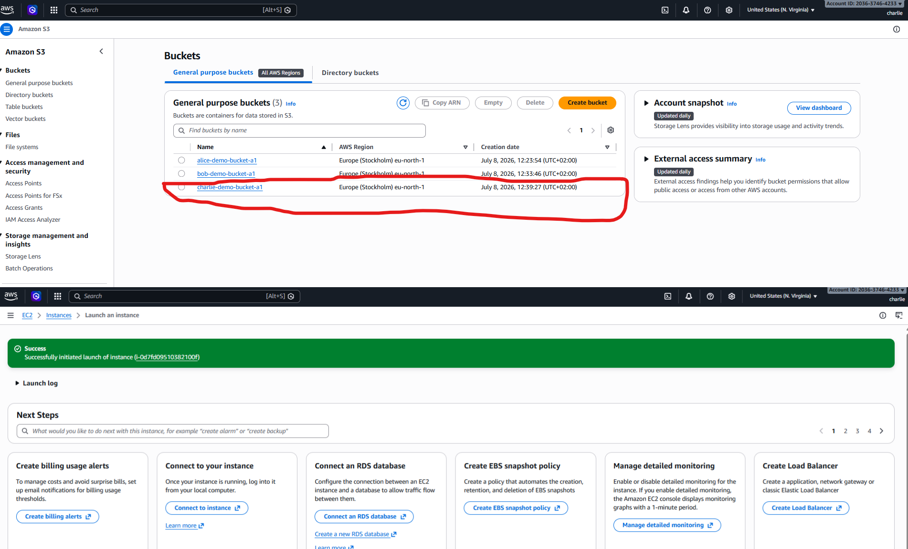

- S3 create bucket: ✅ SUCCESS
- EC2 launch instance: ✅ SUCCESS

### Summary of Test Results:

| User    | S3 Full | EC2 View | EC2 Launch | Result      |
| ------- | ------- | -------- | ---------- | ----------- |
| alice   | ✅      | ✅       | ❌         | As expected |
| bob     | ✅      | ✅       | ❌         | As expected |
| charlie | ✅      | ✅       | ✅         | As expected |

---

## Exercise 5: Custom Policy

### Policy JSON: 

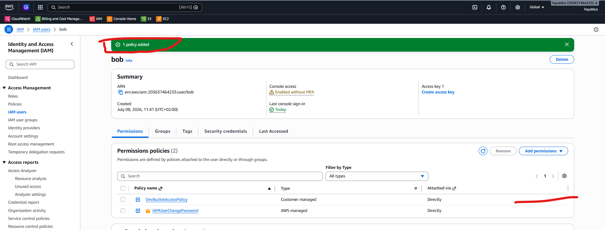

```json
{
    "Version": "2012-10-17",
    "Statement": [
        {
            "Sid": "ListAllBuckets",
            "Effect": "Allow",
            "Action": "s3:ListAllMyBuckets",
            "Resource": "*"
        },
        {
            "Sid": "DevBucketAccess",
            "Effect": "Allow",
            "Action": [
                "s3:ListBucket",
                "s3:GetObject",
                "s3:PutObject",
                "s3:DeleteObject"
            ],
            "Resource": [
                "arn:aws:s3:::dev-bucket",
                "arn:aws:s3:::dev-bucket/*"
            ]
        }
    ]
}
```

### Custom Policy Test:

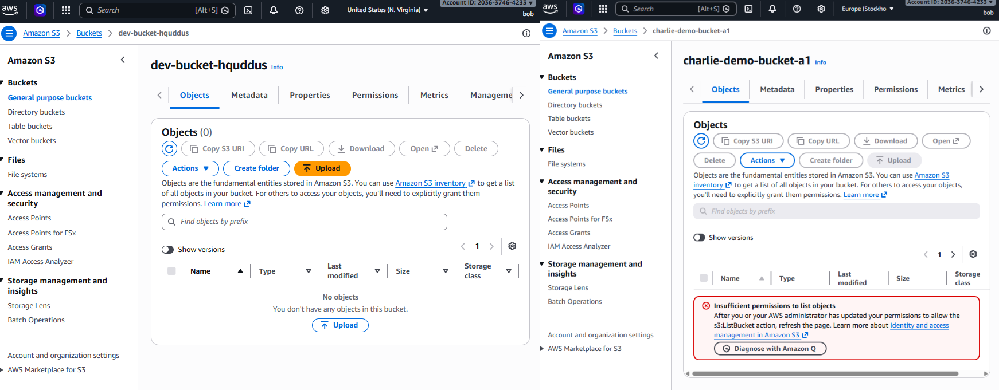

**Bob's Access After Custom Policy:**

- Access dev-bucket: ✅ SUCCESS
- Access other buckets: ❌ DENIED (Expected)

---

## Exercise 6: MFA Configuration


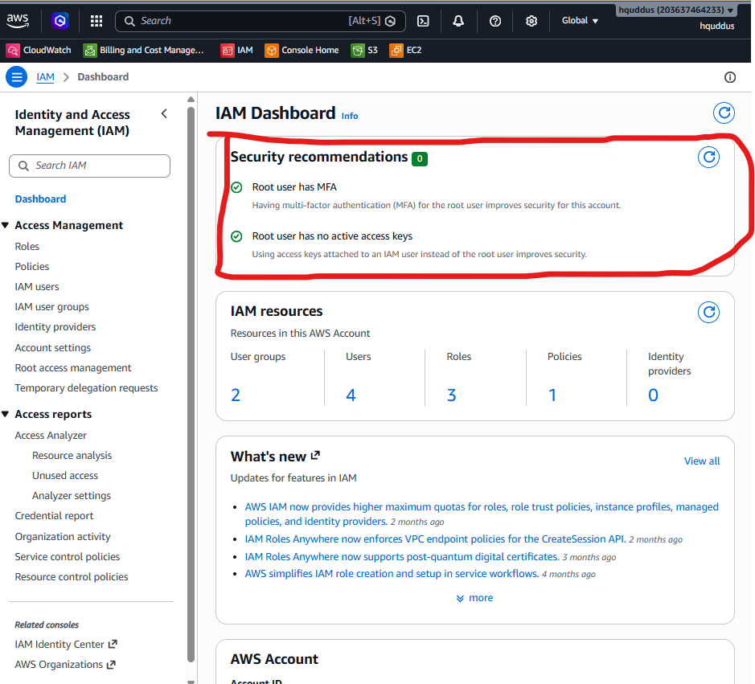

**MFA Details:**

- User: admin user
- Device type: Virtual MFA
- Authenticator app: Google Authenticator
- Status: ✅ Active

---

## Bonus Challenges: NA

### Challenge 1: Password Policy


**Policy Settings:**

- [X] Minimum length: 12 characters
- [X] Require uppercase letters
- [X] Require lowercase letters
- [X] Require numbers
- [X] Require symbols
- [X] Password expiration: 90 days

---

### Challenge 2: Access Analyzer


**Findings:**

- Number of findings: [X]
- Critical issues: [List any public access found]
- Recommendations: [Your notes]

---

### Challenge 3: CLI Access Keys

**Alice Access Key Created:** [Yes / No]

**CLI Test Output:**

```bash
$ aws s3 ls --profile alice
[Paste output here]
```

**Screenshot:** [If applicable]

---

## Reflection Questions

### 1. Why use groups instead of attaching policies directly to users?

**Your Answer:**

Groups make permission management easier, consistent, and scalable. Users can be added to groups based on roles instead of managing each user separately.

---

### 2. What are the risks of giving everyone AdministratorAccess?

**Your Answer:**

It creates security risks because users get more access than needed. They may accidentally delete resources, expose data, or cause compliance issues.

---

### 3. How would you organize IAM for 50 developers across 5 projects?

**Your Answer:**

I would create project-based and role-based groups, assign required permissions only, use IAM roles, and organize resources with tags.

---

### 4. What happens if you delete an IAM user? Can you recover their permissions?

**Your Answer:**

IAM user deletion is permanent. Permissions cannot be restored automatically but can be recreated by creating a new user and assigning policies again.

---

## Key Learnings

**What was most challenging about this lab?**

]Understanding IAM users, groups, roles, and how permissions work together.

---

**What IAM best practice will you always follow?**

Always follow least privilege and give users only the access they need.

---

**How does IAM help implement the principle of least privilege?**

]IAM controls access through policies so users only receive required permissions.

---

## Checklist

- [X] All 3 users created (alice, bob, charlie)
- [X] Both groups created (Developers, DevOps)
- [X] Permissions tested for each user
- [X] Custom policy created and tested
- [X] MFA enabled for at least one user
- [X] All screenshots captured
- [X] All reflection questions answered
- [X] Policy JSON file saved
- [X] Work committed to Git
- [X] Pull request created

---

**Completed By:** Hafiz Abdul Quddus
**Date:** 08-07-2026
